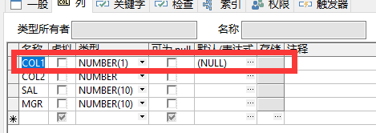

# 约束


> 一个字段可以有多个约束（前提不冲突）

- **什么是约束？**

  给表增加规则和条件（限制）。

- **约束的作用：**

  可以让表更加符合实际要求。因为约束具有不符合条件的数据不予录入的特点。

- **约束的分类：**

  **列级约束**（六种）：主键（PRIMARY KEY）,外键（FOREIGN KEY）,唯一（UNIQUE）,检查（CHECK）,非空(/空值）(NOT NULL/NULL) ,默认（DEFAULT）

  **表级约束**（四种）：主键（PRIMARY KEY）,外键（FOREIGN KEY）,唯一（UNIQUE）,检查（CHECK）

  （主键=非空+唯一）

- **列级约束和表级约束的区别：**

​	当一个约束只约束一个列时，他是列级约束；

​	当一个约束同时约束多个列时，他是表级约束；


## 一、非空约束 (NOT NULL/NULL)

### 1.可以在创建表的时候创建非空约束

语法：`CREATE TABLE` 表名 (字段1 数据类型 `NULL`,字段2 数据类型 `NOT NULL`,...)
--限制可以为空值写不写`NULL`影响不大

```sql
CREATE TABLE EMP3(EMPNO NUMBER(4) NULL,DEPTNO NUMBER(2) NOT NULL,SAL NUMBER(10));
SELECT * FROM EMP3;
INSERT INTO EMP3 VALUES(1111,'',800);--报错
INSERT INTO EMP3 VALUES('',10,'');--可以
```

特点：

- NULL可以省略的，隐藏的默认值
- 插入违反约束条件的数据会报错
- 只能影响一个列，是列级约束，没有表级约束
- 如果列内有空值，约束不能改成非空

### 2.给表新增字段时，同时建立非空约束

语法：`ALTER TABLE` 表名 `ADD`(字段1 数据类型 `NULL`/`NOT NULL`,...)

```sql
ALTER TABLE EMP3 ADD(ENAME VARCHAR2(10) NOT  NULL);--报错，在新增列的时候，下面的数据为空，与非空约束冲突

ALTER TABLE EMP3 ADD(ENAME VARCHAR2(10)  NULL);

UPDATE EMP3 SET ENAME = '朱精卫' WHERE EMPNO =1111;
```

### 3.给已有字段建立非空约束

语法：`ALTER TABLE` 表名 `MODIFY`(字段1 `NOT NULL`/`NULL`);

```sql
修改数据类型
ALTER TABLE EMP3 MODIFY(SAL CHAR(10));

语法：ALTER TABLE 表名 MODIFY(字段1 NOT NULL/NULL);

ALTER TABLE EMP3 MODIFY(SAL NOT NULL);--报错，因为列内本身有空值
```

**拓展：**

- 约束能不能修改成自己？

  ```sql
  ALTER TABLE EMP3 MODIFY(SAL NULL);--不能
  ```

  

- 能否新增一个同名列，约束不同？

  ```sql
  ALTER TABLE EMP3 ADD(SAL NUMBER NULL);--不能创建同名列
  ```

  

`CONSTRAINT` --起约束名的关键词
约束名的起名规则：`约束名_表名_列名`
**注意：**

- 同一个用户下，约束名不能重复
- 同一个用户下，表名不能重复
- 同一个表中，列名不能重复

```sql
SELECT * FROM EMP3;
DROP TABLE EMP3;
```

## 二、唯一约束 UNIQUE

> 同一列内数据不能重复

### 1.可以在创建表的时候创建唯一约束

`CREATE TABLE` 表名(字段1 数据类型 `CONSTRAINT` 约束名1 `UNIQUE`,字段2 数据类型 `CONSTRAINT` 约束名2 `UNIQUE`,...);--**列级约束**

```SQL
CREATE TABLE EMP3(EMPNO NUMBER(4) CONSTRAINT UNI_EMP_EMPNO UNIQUE);
INSERT INTO EMP3 VALUES(1111);
INSERT INTO EMP3 VALUES(2222);
```

`CREATE TABLE` 表名(字段1 数据类型,字段2 数据类型,...,`CONSTRAINT` 约束名 `UNIQUE`(字段1,字段2,...))--**表级约束**

```SQL
CREATE TABLE EMP3(EMPNO NUMBER,DEPTNO NUMBER ,CONSTRAINT UNI_EMP UNIQUE (EMPNO,DEPTNO));

INSERT INTO EMP3 VALUES(1111,10);
INSERT INTO EMP3(DEPTNO) VALUES(10);
```

--当表级约束约束多个列时，多个列为一个整体，有一个不一样都算不一样

--约束名能否取一样的名字

```sql
SELECT * FROM EMP3;
CREATE TABLE EMP3(EMPNO NUMBER(4) CONSTRAINT UNI_EMP_EMPNO UNIQUE);
ALTER TABLE EMP3 ADD(DEPTNO NUMBER(4) NULL);
```

--一个表内可以插入不同的约束

```SQL
ALTER TABLE EMP3 ADD(ENAME VARCHAR2(10) CONSTRAINT  UNI_EMP_EMPNO UNIQUE);
```

--同一个表内，约束名不能重复

```SQL
CREATE TABLE EMP1 AS SELECT * FROM EMP;
ALTER TABLE EMP1 ADD(SEX VARCHAR2(10) CONSTRAINT  UNI_EMP_EMPNO UNIQUE);
```

--同一个用户下，约束名不能重复

### 2.给表新增字段时，同时建立非空约束

语法：`ALTER TABLE` 表名 `ADD`(字段1 数据类型 `CONSTRAINT` 约束名 `UNIQUE`);--列级约束

==*列级约束*==

`ALTER` `TABLE` 表名 `ADD`(字段1 数据类型 `CONSTRAINT` 约束名1 `UNIQUE`,字段2 数据类型 `CONSTRAINT` 约束名2 `UNIQUE`,...);

```sql
ALTER TABLE EMP3 ADD(JOB VARCHAR2(10) CONSTRAINT UNI_EMP_JOB UNIQUE);
```

==*表级约束*==

`ALTER` `TABLE` 表名 `ADD`(字段1 数据类型,字段2 数据类型,..,`CONSTRAINT` 约束名 `UNIQUE`(字段1,字段2,...));

```sql
ALTER TABLE EMP3 ADD(SAL NUMBER(10),MGR NUMBER(10), CONSTRAINT UNI_EMP UNIQUE(SAL,MGR));
```


### 3.给已有字段建立唯一约束

*==列级约束==*

`ALTER` `TABLE` 表名 `MODIFY`(字段1 数据类型 `CONSTRAINT` 约束名 `UNIQUE`,字段2 数据类型 `CONSTRAINT` 约束名 `UNIQUE`,...);

```sql
ALTER TABLE EMP3 MODIFY(SAL NUMBER(10) CONSTRAINT UNI_EMP_JOBB UNIQUE);
```

*==表级约束==*

`ALTER` `TABLE` 表名 `MODIFY`(字段1 数据类型,字段2 数据类型,..,`CONSTRAINT` 约束名 `UNIQUE`(字段1,字段2,...));

```sql
ALTER TABLE EMP2 MODIFY(EMPNO NUMBER(4),DEPTNO NUMBER(2),CONSTRAINT UNI_EMP2 UNIQUE(EMPNO,DEPTNO));
```

问：能否将数据类型去掉？--可以

```sql
ALTER TABLE EMP2 MODIFY(COMM  CONSTRAINT UNI_EMP2_COMM UNIQUE);

ALTER TABLE EMP2 MODIFY(JOB,ENAME ,CONSTRAINT UNI_EMP2_JE UNIQUE(JOB, ENAME));
```


## 三、主键约束  PRIMARY KEY

> 主键=非空+唯一 --说明里面既不能为空值，也不能有重复的值
>

### 1.在创建表的时候创建主键约束

/*==列级约束==*/ 

`CREATE` `TABLE` 表名(字段1 数据类型 `CONSTRAINT` 约束名1 `PRIMARY` `KEY`);

```sql
CREATE TABLE EMP3(EMPNO NUMBER(10) CONSTRAINT PK_EMP3_EMPNO PRIMARY KEY,DEPTNO NUMBER(10)  CONSTRAINT UNI_EMP3_DEPTNO unique);
SELECT * FROM EMP3;
INSERT INTO EMP3 VALUES(1111);
INSERT INTO EMP3 VALUES('');
```

一个表内只能创建一个主键约束
一个语句里面可以同时创建不同的约束

问：1.一个列上只能有一个约束吗？--不是
2.如果只能有一个主键约束，为什么会有表级约束呢？

==表级约束==

`CREATE` `TABLE` 表名(字段1 数据类型,字段2 数据类型,...,`CONSTRAINT` 约束名 `PRIMARY` `KEY`(字段1,字段2,...))

```sql
CREATE TABLE EMP3(EMPNO NUMBER(10),DEPTNO NUMBER(10), CONSTRAINT PK_EMP3 PRIMARY KEY(EMPNO,DEPTNO));
INSERT INTO EMP3 VALUES(1111,2222);--如果插入两次报错
INSERT INTO EMP3 VALUES(1111,3333);--有一个数据不同可以插入
INSERT INTO EMP3 VALUES('',3333);--报错，空值不能插入
```


### 2.给表新增字段时，同时建立主键约束

==列级约束==

ALTER TABLE 表名 ADD(字段1 数据类型 CONSTRAINT 约束名1 PRIMARY KEY);

```sql
ALTER TABLE EMP3 ADD(JOB VARCHAR2(10) CONSTRAINT UNI_EMP_JOB PRIMARY KEY);
如果创建表的时候已经有了主键约束，新增字段是不能再创建主键约束
```

==表级约束==

ALTER TABLE 表名 ADD(字段1 数据类型,字段2 数据类型,.. CONSTRAINT 约束名 PRIMARY KEY(字段1,字段2,...));

```sql
ALTER TABLE EMP3 ADD(SAL NUMBER(10),MGR NUMBER(10) CONSTRAINT UNI_EMP PRIMARY KEY(SAL,MGR));
```


### 3.给已有字段建立主键约束

==列级约束== 

ALTER TABLE 表名 MODIFY(字段1 数据类型 CONSTRAINT 约束名 PRIMARY KEY);

```sql
ALTER TABLE EMP3 MODIFY(SAL NUMBER(10) CONSTRAINT UNI_EMP_JOBB UNIQUE);
```

==表级约束==

ALTER TABLE 表名 MODIFY(字段1 数据类型,字段2 数据类型,..,CONSTRAINT 约束名 PRIMARY KEY(字段1,字段2,...));

```sql
ALTER TABLE EMP2 MODIFY(EMPNO NUMBER(4),DEPTNO NUMBER(2),CONSTRAINT UNI_EMP2 PRIMARY KEY(EMPNO,DEPTNO));


一个列上只能有一个约束吗？--不是
DROP TABLE EMP3;

CREATE TABLE  EMP3 (EMPNO NUMBER CONSTRAINT UNI_EMP3_EMPNO UNIQUE);--有一个UNIQUE的唯一约束，也有一个NULL的可以为空值的约束
ALTER TABLE EMP3 MODIFY(EMPNO NOT NULL);
--MODIFY不是修改约束，而是增加约束

有兴趣的可以试一下：--主键约束不能和唯一约束创建在同一个列上，但是能和非空约束创建在同一个列上

删除约束的方法
ALTER TABLE 表名 DROP CONSTRAINT 约束名;
问题：能否同时删除多个约束呢？
ALTER TABLE 表名 DROP CONSTRAINT 约束名1 DROP CONSTRAINT 约束名2 ; 
```

> MODIFY不是修改约束，而是增加约束
>
> 主键约束不能和唯一约束创建在同一个列上，但是能和非空约束创建在同一个列上
>
> 一个列上能有多个约束


## 四、检查约束

是给字段制定一个范围，插入数据时，会先检查是否符合范围，符合才能插入。

> 注意检查约束中不能使用子查询

### 1.在创建表的时候创建检查约束

语法：

==列级约束==

 CREATE TABLE 表名 (字段1 数据类型 CONSTRAINT 约束名1 CHECK(范围1),字段2 数据类型 CONSTRAINT 约束名2 CHECK(范围2),...)

```sql
CREATE TABLE EMP3 (EMPNO NUMBER(10,2) CONSTRAINT CH_EMP3_EMPNO CHECK(EMPNO<30));
SELECT * FROM EMP3;
INSERT INTO EMP3 VALUES(10);
INSERT INTO EMP3 VALUES(30);--报错
INSERT INTO EMP3 VALUES(29.9999);--报错
```

==表级约束==

CREATE TABLE 表名(字段1 数据类型,字段2 数据类型,...,CONSTRAINT 约束名 CHECK(范围1,范围2,..,))

```sql
CREATE TABLE EMP3(EMPNO NUMBER(4),DEPTNO NUMBER(2),CONSTRAINT CH_EMP3 CHECK(EMPNO < 30 AND DEPTNO>30));
INSERT INTO EMP3 VALUES(10,40);
INSERT INTO EMP3 VALUES(30,40);
INSERT INTO EMP3(DEPTNO) VALUES(40);
```


### 2.给表新增字段时，同时建立检查约束

==列级约束== 

ALTER TABLE 表名 ADD(字段1 数据类型 CONSTRAINT 约束名1 CHECK(范围1),字段2 数据类型 CONSTRAINT 约束名2 CHECK(范围2),...);

```sql
ALTER TABLE EMP3 ADD(SAL NUMBER(10) CONSTRAINT CH_EMP3_SAL CHECK(SAL BETWEEN 1000 AND 3000));
```

==表级约束==

ALTER TABLE 表名 ADD(字段1 数据类型,字段2 数据类型,..,CONSTRAINT 约束名 CHECK(范围1,范围2,...));

```sql
ALTER TABLE EMP3 ADD(SEX VARCHAR2(3),SSEX VARCHAR2(9), CONSTRAINT CH_EMP33 CHECK(SEX IN ('男','女') OR SSEX= '中间人'));
```


### 3.给已有字段建立检查约束

==列级约束== 

`ALTER` `TABLE` 表名 `MODIFY`(字段1 数据类型 `CONSTRAINT` 约束名 `CHECK`(范围1),字段2 数据类型 `CONSTRAINT` 约束名 `CHECK`(范围2),...);

```sql
ALTER TABLE EMP3 MODIFY(COMM NUMBER(10) CONSTRAINT CH_EMO3_COMM CHECK(COMM IS NOT NULL));--试试这种情况
可以
ALTER TABLE EMP3 MODIFY(COMM NUMBER(10) CONSTRAINT CH_EMO3_COMM CHECK(COMM IS  NULL));--试试这种情况
k
ALTER TABLE EMP3 MODIFY(COMM NUMBER(10) CONSTRAINT CH_EMO3_COMM CHECK(COMM  >(SELECT MIN(SAL) FROM EMP)));--试试这种情况
检查约束不能使用子查询
```

==表级约束== 

ALTER TABLE 表名 MODIFY(字段1 数据类型,字段2 数据类型,..,CONSTRAINT 约束名 CHECK(范围1,范围2,...));

```sql
ALTER TABLE EMP2 MODIFY(EMPNO NUMBER(4),DEPTNO NUMBER(2),CONSTRAINT CH_EMP2 CHECK(EMPNO>0 AND DEPTNO<=40));
```


## 五、外键约束 FOREIGN KEY

> 指当前列一定得从其他表中的主键或者唯一列上获取参照物
> EMP表中的DEPTNO列,只能输入10，20，30，40，这些值从DEPT表中的DEPTNO列获取

### 1.在创建表的时候创建外键约束

语法：

==列级约束==

`CREATE` `TABLE` 表名 (字段1 数据类型 , `CONSTRAINT` 约束名1 `FOREIGN` `KEY` (外键列的字段名) `REFERENCES` 参照表(参照列));

```sql
CREATE TABLE EMP3(DEPTNO NUMBER(2),CONSTRAINT FK_EMP3_DEPTNO FOREIGN KEY(DEPTNO) REFERENCES EMP(SAL));
SELECT * FROM EMP3;
INSERT INTO EMP3 VALUES(12);
```

> 1.参照列一定是其他表内的主键或者唯一列，外键列不需要是唯一或者主键列
> 2.插入的值只能是参照物里面的内容
> 3.外键约束在数据类型后面==有逗号==


==表级约束==
`CREATE` `TABLE` 表名 (字段1 数据类型 ,字段2 数据类型, `CONSTRAINT` 约束名 `FOREIGN` `KEY` (外键列的字段名1,字段名2) `REFERENCES` 参照表(参照列1,参照列2));

```sql
CREATE TABLE EMP3(ENAME NUMBER(4),JOB NUMBER(4),CONSTRAINT FK_EMP3 FOREIGN KEY(ENAME,JOB) REFERENCES EMP(EMPNO,SAL));
--假设SAL是唯一列
--如果参照表里面的参照列是列级约束，是无法满足前面建立的表级外键约束
```

注意：

4.外键列和参照列名字可以不一样，数据类型必须保持一致
5.表级外键的参照列必须也是表级的

### 2.给表新增字段时，同时建立外键约束

==列级约束==

`ALTER` `TABLE` 表名 `ADD`(字段1 数据类型 ,`CONSTRAINT` 约束名1 `FOREIGN` `KEY` (外键列的字段名1) `REFERENCES` 参照表(参照列));

==表级约束==
`ALTER` `TABLE` 表名 `ADD` (字段1 数据类型 ,字段2 数据类型, `CONSTRAINT` 约束名 `FOREIGN` `KEY` (外键列的字段名1,字段名2) `REFERENCES` 参照表(参照列1,参照列2));

### 3.给已有字段建立外键约束

*==列级约束==* `ALTER` `TABLE` 表名 `MODIFY`(字段1 数据类型 ,`CONSTRAINT` 约束名1 `FOREIGN` `KEY` (外键列的字段名1) `REFERENCES` 参照表(参照列));

*==表级约束==* 
`ALTER` `TABLE` 表名 `MODIFY`(字段1 数据类型 ,字段2 数据类型, `CONSTRAINT` 约束名 `FOREIGN` `KEY` (外键列的字段名1,字段名2) `REFERENCES` 参照表(参照列1,参照列2));

## 六、默认约束   DEFAULT

> 当给表插入一行数据时，含有默认约束的列如果没有插入数据，会用默认值自动填充
> 不能起约束名
> 不能用删除约束的方法对待默认值

### 1.建表的同时建立默认约束

语法：

*==列级约束==*

`CREATE` `TABLE` 表名(字段1 数据类型 `DEFAULT`(默认值1),字段2 数据类型 `DEFAULT`(默认值2),...);

```sql
CREATE TABLE EMP3(EMPNO NUMBER(4),SEX VARCHAR2(3) DEFAULT ('男'));
SELECT * FROM EMP3;
INSERT INTO EMP3 VALUES(1111,'男');
INSERT INTO EMP3 VALUES(1111,'女');
INSERT INTO EMP3(EMPNO) VALUES(1111);
INSERT INTO EMP3(SEX) VALUES('女');
```

==默认约束没有表级约束==

### 2.给表新增字段时，同时建立默认约束

`ALTER` `TABLE` 表名 `ADD`(字段1 数据类型 `DEFAULT`(默认值1),字段2 数据类型 `DEFAULT`(默认值2),...);

### 3.给已有字段建立默认约束

`ALTER` `TABLE` 表名 `MODIFY`(字段1 数据类型 `DEFAULT`(默认值1),字段2 数据类型 `DEFAULT`(默认值2),...);

默认值的==修改==方式
`ALTER` `TABLE` 表名 `MODIFY`(字段1 数据类型 `DEFAULT`(默认值1),字段2 数据类型 `DEFAULT`(默认值2),...);
--问题：现在是在之前的基础上增加限制，还是进行修改呢？

默认值的==删除==方式
`ALTER` `TABLE` 表名 `MODIFY`(字段1 数据类型 `DEFAULT` (''));

```sql
ALTER TABLE 表名 MODIFY(字段1 数据类型 DEFAULT (NULL));--这个会不会报错？
不会
```




## 七、其他

### 1.删除约束的方法

> 补充：删除列    `ALTER` `TABLE` 表名 `DROP` `COLUMN` 列名

`ALTER` `TABLE` 表名 `DROP` `CONSTRAINT` 约束名;

**删除表的==单个==字段约束**

```sql
ALTER  TABLE  表名  DROP   UNIQUE(字段名);
```

**删除表的==多个==字段约束**

```sql
ALTER  TABLE  表名  DROP   CONSTRAINT  约束名;
```

### 2.约束重命名

> 表的重命名 ：ALTER TABLE 旧表名 RENAME TO 新表名;
> 列的重命名：ALTER TABLE 表名 RENAME COLUMN 旧列名 TO 新列名;

`ALTER` `TABLE` 表名 `RENAME` `CONSTRAINT` 旧约束名 `TO` 新约束名;

### 3.约束禁用 DISABLE

`ALTER` `TABLE` 表名 `DISABLE` `CONSTRAINT` 约束名;

### 4.约束启用 ENABLE

`ALTER` `TABLE` 表名 `ENABLE` `CONSTRAINT` 约束名;

- 在约束被禁用后，如果插入了不符合约束的数据，无法再启用约束
- 唯一或者主键被外键引用时，无法直接删除带有唯一或主键的表，需要先删除外键约束。


**给表的单个字段加约束**

```sql
ALTER  TABLE  表名   ADD   UNIQUE(字段名);
```

 

```sql
ALTER  TABLE  表名   ADD  CONSTRAINT 约束名   UNIQUE (字段名, 字段名 ...);
```

**查询某表都有哪些约束**

```sql
select  CONSTRAINT_NAME  from  USER_CONSTRAINT   WHERE  TABLE_NAME=表名    AND   CONSTRAINT_TYPE=U;
```

**查询某约束都约束了哪些字段**

```sql
select  COLUMN_NAME  from  USER_CONS_COLUMN  WHERE  CONSTRAINT_NAME=约束名;
```
