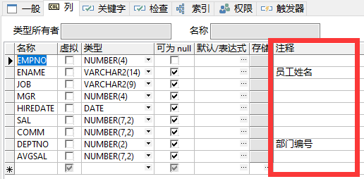
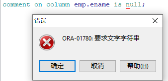
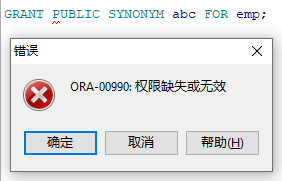
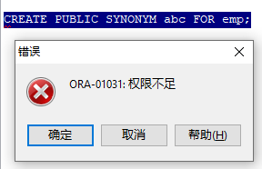

# 注释

> 单行注释  `--`
>
> 多行注释  `/* */`
>
> 方便了解sql语句的作用等


## 1.列注释

语法：`COMMENT` `ON` `COLUMN` 表名.列名 `IS` '注释内容';

```SQL
comment on column emp.deptno is '部门编号';
```

|  |
| :----------------------------------------------------------: |


### 修改注释：

> 1.CTRL+鼠标左键 直接修改
>
> 2.再次输入语句`comment on column emp.deptno is '更改后的注释';`

### 删除注释：

> 1.CTRL+鼠标左键 直接删除
>
> 2.再次输入语句`comment on column emp.deptno is '';`（单引号内不写内容）
>
> 不能使用null（如下图）

|  |
| :----------------------------------------------------------: |


## 2.表级注释

语法：`COMMENT` `ON` `TABLE` 表名 `IS` '注释的内容';

==修改 删除 方法同上==


# 同义词

**语法：**

```sql
CREATE [OR REPLACE] [PUBLIC] SYNONYM [schema.] synonym_name FOR [schema.] object_name [@dblink];
```

**语法说明：**
`OR REPLACE`: 在不使用DROP的前提下容许你重新创建（如果同义词已经存在）。

`PUBLIC`: 所创建的同义词是全局的同义词，所有数据库用户都可以使用。

`schema`: 要创建同义词的对象所在的schema,如果省略，则默认的应用对象在当前`schema`下。

`object_name`: 要创建同义词的对象，它可以是以下几种类型：

- TABLE
- VIEW
- SEQUENCE
- STORED PROCEDURE
- FUNCTION
- PACKAGE
- MATERIALIZED VIEW
- JAVA CLASS SCHEMA OBJECT
- USER-DEFINED OBJECT
- SYNONYM


含义：相当于给数据库对象取一个长期有效的别名

分类：

==公有==同义词  所有用户都可以使用 `PUBLIC` `SYNONYM`

==私有==同义词  只能是创建用户或者被授权用户使用 `SYNONYM`


赋予用户查看某张表的权限：

```SQL
GRANT SELECT ON 用户名.表名 TO 用户名;
```

## 公有同义词

语法：`CREATE` `PUBLIC` `SYNONYM` 公有名 `FOR` 对象名;

```SQL
CREATE PUBLIC SYNONYM abc FOR emp;
```



> 更换为管理员用户后成功创建

```sql
SELECT * FROM abc;
```



> 原因：当前用户下不存在emp表 同理使用同义词也找不到表

**正确使用方法：**

```sql
CREATE PUBLIC SYNONYM scottemp FOR scott.emp;
select * from scottemp;
```

> 在管理员用户下给scott用户下的emp表创建同义词

**删除==公有==同义词：**

`DROP` `PUBLIC` `SYNONYM` 同义词;


## 私有同义词

语法：`CREATE`  `SYNONYM` 公有名 `FOR` 对象名;

在管理员用户下时：

```sql
SELECT * FROM SCOTT.scottemp
```

> 私有同义词无法直接找到，需要赋予查看权限再来查看表。（由于是管理员，所以这里不用赋权）

问题：

~~同义词前面可以加用户名吗？~~


同义词能在其他用户下删除吗？

可以删除，需要赋予权限  （赋权语句如下）

```sql
grant create [p] synonym to scott
```


## 删除同义词

**语法：**

```sql
DROP [PUBLIC] SYNONYM [schema.] synonym_name [FORCE];
```

**注意：**

`PUBLIC`: 容许删除PUBLIC同义词， 如果使用了PUBLIC关键字，则可以省略schema。

`FORCE`：用来强制删除同义词，即使它在数据库中有其它的依赖。


> **补充：**
>
> 授权某个用户crate synonym的权限，若用户名为scott
>
> ```sql
> grant create synonym to scott
> ```
>
> 创建同义词
>
> ```sql
> create [or replace] synonym syn_name from table_name;
> ```
>
> 撤销scott创建同义词的权限
>
> ```sql
> revoke create synonym from scott;
> ```
>
> 删除同义词
>
> ```sql
> drop synonym syn_name
> ```
>
> 查看所有同义词
>
> ```sql
> select * from dba_synonyms
> ```
>
> 获取当前所有的同义词表名：
>
> ```sql
> select  table_name from  user_synonyms
> ```
>
> 查询所有同义词表的所有者：
>
> ```sql
> select  table_owner   from  user_synonyms
> ```
>
> 查询当前同义词表的所有者：
>
> ```sql
> select  table_owner  from  user_synonyms  WHERE table_name = '大写表名'
> ```
>
> 查询同义词表的表数据：
>
> ```sql
> select   *  from   大写所有者名.大写表名
> ```
>
> 查询同义词表的表结构基本信息（字段名称，字段类型，字段长度等信息）：
>
> ```sql
> select  COLUMN_NAME,DATA_TYPE,DATA_LENGTH   from   dba_tab_columnswhere table_name =  '(大写表名)'   AND   OWNER = (大写所=属名)   order   by   COLUMN_NAME;
> ```