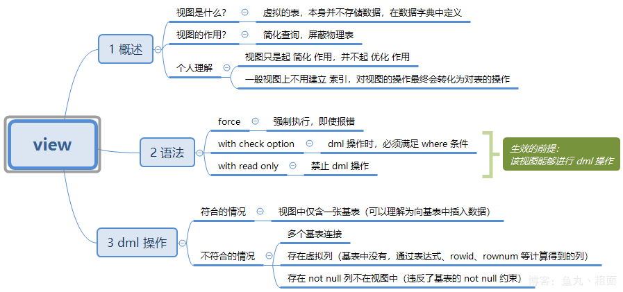
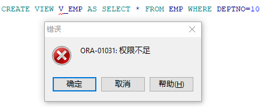
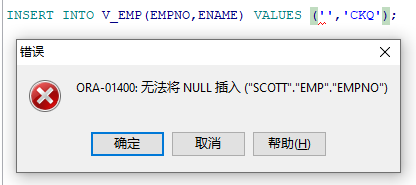
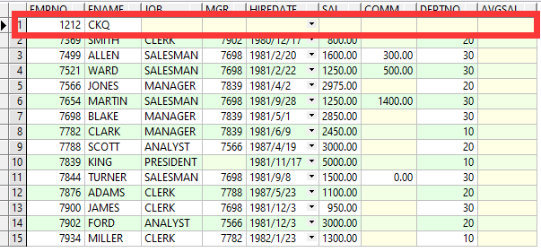
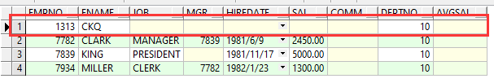
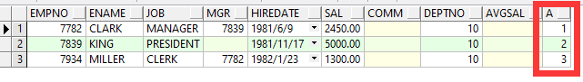
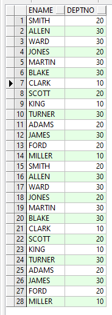
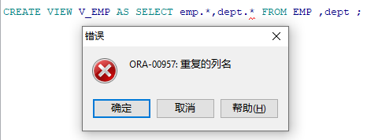
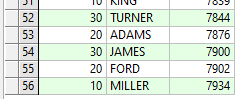
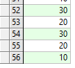

# 视图

含义：将查询的结果动态保存到数据库中的一张虚拟表上。

特点：占用空间小，查询速度快，能像普通表一样使用，能动态获取结果。视图只有逻辑定义。每次使用的时候,只是重新执行SQL。

关键词：`VIEW`



**完整语法：**

```sql
CREATE [OR REPLACE] [{FORCE|NOFORCE}] VIEW view_name

AS

SELECT 查询

[WITH READ ONLY CONSTRAINT]
```

**语法详解：**

1. `OR REPLACE`：如果视图已经存在，则替换旧视图。
2. `FORCE`：即使基表不存在，也可以创建该视图，但是该视图不能正常使用，当基表创建成功后，视图才能正常使用。
3. `NOFORCE`：如果基表不存在，无法创建视图，该项是默认选项。
4. `WITH` `READ` `ONLY`：默认可以通过视图对基表执行增删改操作，但是有很多在基表上的限制(比如：基表中某列不能为空，但是该列没有出现在视图中，则不能通过视图执行`insert`操作)，`WITH READ ONLY`说明视图是只读视图，不能通过该视图进行增删改操作。现实开发中，基本上不通过视图对表中的数据进行增删改操作。


**视图分类：**
1.简单视图，它是基于单个表所建立的，不包含任何函数、表达式以及分组数据的视图。
2.复杂视图，它是指包含函数、表达式或者分组数据的视图，使用复杂视图的主要目的是为了简化查询操作。
3.连接视图，它是指基于多个表所建立的视图，使用连接视图的主要目的是为了简化连接查询。
4.只读视图，它是指只允许执行SELECT操作，而禁止任何DML操作的视图。
在视图上执行DML操作的原则：
1.DELETE操作原则：如果视图包含有GROUP BY子句、分组函数、DISTINCT关键字和ROWNUM伪列，那么不能在该视图上执行DELETE操作。
2.UPDATE操作原则：如果视图包含有GROUP BY子句、分组函数、DISTINCT关键字、ROWNUM伪列以及使用表达式所定义的列，那么不能在该视图上执行UPDATE操作。
3.INSERT操作原则：如果视图包含有GROUP BY子句、分组函数、DISTINCT关键字、ROWNUM伪列以及使用表达式所定义的列，或者在视图上没有包含视图基表的NOT NULL列，那么不能在该视图上执行INSERT操作。


## 1.创建视图

**语法：**

```sql
CREATE VIEW 视图名 AS （ SELECT 字段 from 表/SQL语句）;
```


```SQL
CREATE VIEW V_EMP AS SELECT * FROM EMP WHERE DEPTNO=10
```



> **需要赋予权限：**
>
> `GRANT CREATE VIEW TO SCOTT`


```SQL
INSERT INTO V_EMP(EMPNO,ENAME) VALUES ('','CKQ');
```




### 向视图插入数据：

```SQL
INSERT INTO V_EMP(EMPNO,ENAME) VALUES ('1212','CKQ');
SELECT * FROM EMP;
```



> 此时源表中出现了数据，向视图插入数据，源表也会出现数据。


### 向源表插入数据：

```SQL
INSERT INTO EMP(EMPNO,ENAME，DEPTNO) VALUES ('1313','CKQ',10);
SELECT * FROM V_EMP;
```



> 此时视图中出现了数据，向源表插入数据，视图也会出现数据。


### 总结：

> - 在视图中进行增加操作，原表也会进行对应的操作
> - 在EMP表中，EMPNO带有主键约束，结合上面一点，所以在视图中进行增加操作必须加上EMPNO这一列
> - 如果在视图中插入不符合条件的数据，不会报错，但是不会显示在视图中（因为视图创建时加了条件），==源表会显示==；同时反过来也相同； 即：双向绑定


## 2.修改视图

语法：

```SQL
CREATE OR REPLACE VIEW 视图名 AS （ SELECT 字段 from 表/SQL语句）;
```


## 3.删除视图

语法：

```sql
DROP VIEW 视图名;
```

例如：

```SQL
DROP VIEW V_EMP;
```

> 注意：删除视图不会影响源表


## 思考：

### 1.视图中是否可以使用函数或者来源表中不存在的列？

==可以== 

```sql
CREATE VIEW V_EMP AS SELECT emp.*,rownum a FROM EMP WHERE DEPTNO=10
select * from V_EMP
```



> 不存在的列必须有==别名==


### 2.可以基于表连接创建视图吗？可以

```sql
CREATE VIEW V_EMP AS SELECT ename,deptno FROM EMP union all SELECT ename,deptno FROM EMP ;
select * from V_EMP
```



> 交并补可以在此处使用


```sql
CREATE VIEW V_EMP AS SELECT emp.*,dept.* FROM EMP ,dept ;
```



```sql
CREATE VIEW V_EMP AS SELECT emp.deptno,ename,emp.empno FROM EMP ,dept ;
select * from V_EMP
```



> 使用表连接时注意不能出现重复列名
>
> 当表连接的表被删除一个后，视图还会存在，但是无法查询，可以再创建一个同名字的表，该视图还能继续使用

### 3.可以用视图做表连接吗？

==可以==

```sql
select a.deptno from V_EMP a,V_EMP b;
```

> 表连接时，如果有相同列名需要明确指定


### 4.可以基于视图创建视图吗？

==可以==

```sql
CREATE VIEW V_EMP1 AS select deptno from V_EMP ;
select * from V_EMP1
```




### 5.虚拟列在以上哪个地方有体现？

> 表中不存在的列为虚拟列


# 物化视图

是一张实际存在的表，在源表上复制数据

**优点：**运行效率较快

创建物化视图的语法：`CREATE MATERIALIZED VIEW` 视图名 `AS` SQL语句;
