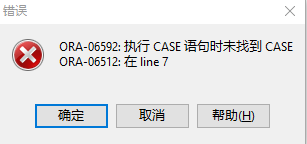

# PLSQL流程化控制语句

## 一、条件判断

### 1.if语句

语法：

`if` 条件一 `then` 结果一;

`elsif` 条件二 `then` 结果二 ;

...

`else` 结果N;

`end` `if`;


### 2.case when语句

语法一：

`CASE`

`WHEN` 条件一 `THEN` 结果一;    

`WHEN` 条件二 `THEN` 结果二;    

...    

`ELSE` 结果;           ==注意一定要有else 否则报错== 

`END` `CASE`;


语法二：

`CASE` 变量

`WHEN` 值一 `THEN` 结果一;    

`WHEN` 值二 `THEN` 结果二;    

...    

`ELSE` 结果;           ==注意一定要有else 否则报错== 

`END` `CASE`;

> 若没有else报错为：
>
> 


例题：

输入一个学号，判断它是不是我们班的学生，如果是 打印'XXX是我们班的'，不是打印'我不认识'

```plsql
declare
	v_no number :=&学号;
begin
	if v_no < 34 then dbms_output.put_line(v_no||'是我们班的');
	else dbms_output.put_line('我不认识');
	end if;
end;
```

输入一个数，判断它跟30的关系，并打印出来。

```plsql
declare
  v_number number:=&数字;
begin
  if v_number<30 then dbms_output.put_line(v_number||'小于30');
  elsif v_number=30 then dbms_output.put_line(v_number||'等于30');
  else dbms_output.put_line(v_number||'大于30');
  end if;
end;
```

输入一个员工编号，判断其是否有佣金，有佣金的打印姓名+佣金，无佣金则打印 姓名+ 无佣金。

```plsql
declare
v_no number:=&编号;
v_temp varchar(11);
v_name varchar(11);
begin
  select ename,comm into v_name,v_temp from emp where empno = v_no;
  if v_temp is not null then  dbms_output.put_line(v_name||v_temp);
  else dbms_output.put_line(v_name||'无佣金');
  end if;
  --dbms_output.put_line(v_temp);
end; 
```


## 二、循环语句


在PLSQL中==不存在无限循环==，因为无限循环一直在运行中，永远不会结束。

### 1.LOOP循环

> 给出一个条件，满足条件的时候退出循环
>

**语法：**

`loop`

​	循环执行语句`;`

​	循环变量更新`;`

​	`exit` `when` 条件`;`

`end` `loop`;

> 在循环内的语句是从上到下按顺序执行的，循环内容的顺序可以调换（==会影响结果==）
>


例子：

编写一个程序，输出 1~7

```plsql

```


### 2.WHILE循环

> 给出一个条件，满足条件的时候执行循环

**语法：**

`while` 条件  `loop`

​	循环执行语句`;`

​	循环变量更新`;`

`end` `loop``;`


### 3.FOR循环

> 给定循环的取值范围，满足条件的时候执行循环  不会有逻辑死循环

**语法：**

`for` 循环变量 `in` 初始值`..`最大值 `loop`         ==循环变量不能当作赋值目标，不能在loop中更改赋值==

​	循环执行语句`;`

​	循环变量更新`;`

`end` `loop``;`

 

编写一个程序，输出1~7之间的奇数

```plsql
declare
  v_no number(1);
begin
  for v_no in 1..7 
  loop
    if mod(v_no,2)!=0 then dbms_output.put_line(v_no);
    end if;
  end loop;
end;
```

