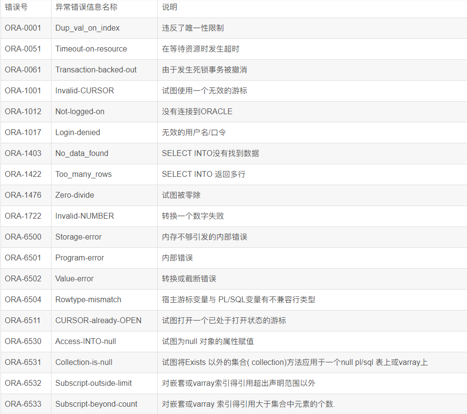

# 异常处理





因为PL/SQL程序块一旦产生异常而没有指出如何处理时,程序就会自动终止整个程序运行，所以我们需要异常处理语句

概念：异常情况处理 exception 是用来处理正常执行过程中未预料的事件,程序块的异常处理预定义的错误和自定义错误

## 异常分类：

### 1.语法错误引发的报错

### 2.程序运行错误引发的报错

```plsql
语法错误案例，异常处理无法解决语法错误
begin
  dbms_output.put_line('贾晶晶声音有点小')--报错原因：没写分号
end;
begin
  dbms_output.put_line(贾晶晶声音有点小);--报错原因：字符串没使用单引号
end;

程序运行错误
declare
  v_emp emp%rowtype;
begin
  select * into v_emp from emp;--错误原因：返回内容超出一条
  dbms_output.put_line(v_emp.empno);
end;

我们所说的异常处理，指的都是程序运行错误
```


## 异常处理的分类

1.预定义异常

--有错误编码，也有错误名称

oracle中预定义的异常常见的有20多种，对于这种异常情况的处理，无需再程序中定义，由oracle自动引发。

2.非预定义异常

--有错误编码，没有错误名称

其他标准的oracle错误，对这种异常情况的处理，需要用户在程序中定义，然后由oracle自动引发。

3.用户定义异常

--错误编码需要自定义，错误名称也需要自定义

程序执行过程中，出现编程人员认为的非正常情况。
对这种异常情况的处理，需要用户在程序中定义，然后显示地在程序中将其引发。

异常处理的语句
`begin`
  执行语句;
  `exception` 
    `when` 异常错误信息名称 `then` 异常处理方法;
    `when` 异常错误信息名称 `then` 异常处理方法;
    `when` `others` `then` 异常处理方法;
`end`;

#### 1.预定义异常

> 有错误编码，也有错误名称
>


例：返回多条数据的错误

```plsql
declare
  v_emp emp%rowtype;
begin
  select * into v_emp from emp;--错误原因：返回内容超出一条
  dbms_output.put_line(v_emp.empno);
  exception when too_many_rows then dbms_output.put_line('返回内容超出一条');
end;
```


例：输入值超出范围的错误
输入一个员工编号，正确的话打印姓名，错误的话打印'查无此人'

```plsql
declare
  v_emp emp%rowtype;
begin
  select ename into v_emp.ename from emp where empno=&员工编号;
   dbms_output.put_line(v_emp.ename);
   exception when no_data_found then dbms_output.put_line('查无此人');
end;
```


思考题：
输入一个部门编号，打印出该部门的员工姓名，薪资。
如果该部门不存在，则输出'该部门不存在',如果该部门人数不止一个，则输出'该部门员工人数过多'

```plsql
declare
  v_emp emp%rowtype;
begin
  select * into v_emp from emp where deptno = &部门编号;
  dbms_output.put_line(v_emp.ename || ' ' || v_emp.sal);
exception
  when no_data_found then
    dbms_output.put_line('该部门不存在');
  when too_many_rows then
    dbms_output.put_line('该部门员工人数过多');
end;
```


#### 2.非预定义异常

> 有错误编码，没有错误名称
> 想要使用必须自己定义错误名称，和错误编码进行绑定

##### 使用非预定义异常的三个步骤

- 在程序块中的声明部分`定义一个异常名称`
- 在声明部分使用函数`将异常名称和错误编码关联` ----- `pragma` 编译指示   `init` 初始化
- 在异常处理部分`捕获异常并使用`


例：删除掉dept表中的20号部门,如果该部门有员工存在，则返回'不能删，该部门还有喘气的'

```plsql
delete from dept where deptno = 20;

declare
  in_fk exception;---定义一个异常名称
  pragma exception_init(in_fk,-02292);--关联异常名称
begin
  delete from dept where deptno = 20;
  exception when in_fk then dbms_output.put_line('不能删，该部门还有喘气的');
end;
```


例：返回多条数据的错误 --（可不可以用非预定义异常来写？）

```plsql
DECLARE
  IN_FK EXCEPTION;
  PRAGMA EXCEPTION_INIT(IN_FK, -01422);
  A EMP%ROWTYPE;
BEGIN
  SELECT * INTO A FROM EMP;
EXCEPTION
  WHEN IN_FK THEN DBMS_OUTPUT.PUT_LINE('太多啦太多啦');
  when too_many_rows then dbms_output.put_line('该部门员工人数过多');--冗余异常，同种异常给了两个解决方法
END;
```

#### 3.自定义异常

> 需要手动引发异常，通常用于不会报错的场景，不需要错误编号跟错误名称，只需要声明异常名称
>

`raise` 异常名称 --引发异常的关键词

**语法结构**
`declare`
  异常名称 `exception`;
`begin`
  执行程序;
  `raise` 异常名称;   -----通常放在if语句中判断
  `exception` `when` 异常名称 `then` 处理方法;
`end`;


例：输入一个员工姓名，如果他的薪资大于2999就正常打印，
小于3000就打印'给老子涨薪'，如果找不到这个员工，就打印'已经提桶跑路'

```plsql
declare
  v_emp emp%rowtype;
  xinziyichang exception;
begin
  select * into v_emp from emp where ename = '&员工姓名';
  if v_emp.sal < 3000 then raise xinziyichang;
  end if;
  dbms_output.put_line(v_emp.sal);
  exception 
    when xinziyichang then dbms_output.put_line('给老子涨薪');
    when no_data_found then  dbms_output.put_line('已经提桶跑路');
end;
```


思考题：
根据输入的参数打印公司信息，如果为1打印部门信息，为2打印员工信息，
添加异常，如果输入的不是1或2则打印'您输入的信息不合法，请输入1或2'

```plsql
declare
  v_no       number := &数值;
  xinxiyouwu exception;
  v_dept     dept%rowtype;
  v_emp      emp%rowtype;
begin
  if v_no = 1 then
    for v_dept in (select * from dept) loop
      dbms_output.put_line(v_dept.dname);
    end loop;
  elsif v_no = 2 then
    for v_emp in (select * from emp) loop
      dbms_output.put_line(v_emp.ename);
    end loop;
  else
    raise xinxiyouwu;
  end if;
exception
  when xinxiyouwu then
    dbms_output.put_line('您输入的信息不合法，请输入1或2');
end;


declare
cursor cur1 is select * from dept;
cursor cur2 is select * from emp;
a number:=&参数;
yichang exception;
begin
  if a=1 then
    for i in cur1 LOOP
      dbms_output.put_line(i.dname);
    end loop;
    elsif a=2 THEN
      for i in cur2 LOOP
      dbms_output.put_line(i.empno);
    end loop;
    else
      raise yichang;
 end if;
 exception
   when yichang then
     dbms_output.put_line('您输入的信息不合法，请输入1或2');
END;
```


-------------------------------------------------------------------------------