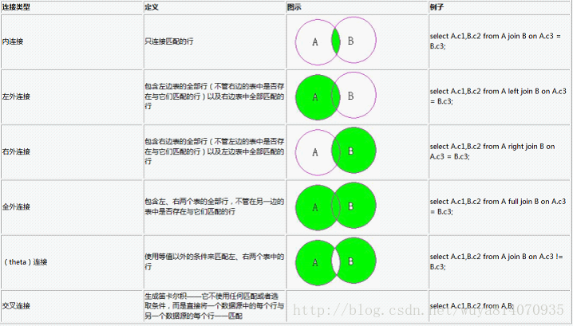

# 进阶查询

## 排序  order by

> **基本语法：**
> select 字段 from 表 where 条件 order by 字段 asc/desc;
> asc 代表：升序排列--默认值，可以省略
> desc 代表：降序排列

> 书写顺序    执行顺序
> select        from
> from          where
> where         select
> order by      order by  --order by 的书写顺序跟执行顺序都在最后

```sql
select * from emp order by deptno asc;
select * from emp order by sal;
select * from emp order by sal desc;

SELECT * FROM emp FOR UPDATE 
```

**思考题**

1.除了数值型，order by 还能排什么类型

```sql
三种类型都可以
--以升序为例，数值型从小到大，日期型从过去到未来，字符型首字母A<Z<a<z,如果首字母相同依此比较
--数值跟字符都有时   数值 < 大写字母 < 小写字母
select * from emp order by sal;
select * from emp order by hiredate;
select * from emp order by ename;
--测试一下汉字排序
```

2.排序能同时排多个字段嘛？会按照什么规则

```sql
select * from emp order by job,sal;
select * from emp order by job,sal desc;
select * from emp order by job desc,sal desc;
select * from emp order by empno,sal;--因为empno列没有重复数据，所以sal排序不起作用
能，按照先写先排，后写后排的排序规则--先写的列内有重复的内容，后写的排序才能发挥作用
```

3.空值在排序时会怎么排

```sql
select * from emp order by comm;
select * from emp order by comm desc;--空值在排序时大于最大值
```

**注意点：**

1.order by 后面除了跟正常的字段名外，还可以跟别名
--因为 order by 执行顺序在 select 之后，所以order by 可以认识别名

```sql
select job 职位 from emp order by 职位;
```

2.可以用数字指代字段--数字几就是第几个字段

```
select ename,job,sal,deptno from emp order by 1;
select ename,job,sal,deptno from emp order by 2;
select ename,job,sal,deptno from emp order by 2,3 desc;
```

3.order by 后面可以跟运算、函数、case when，而且在 order by 后面的内容只参与排序，不显示

```sql
select * from emp order by nvl(comm,1000);
select * from emp order by case when deptno = 10 then 2
                             when deptno = 20 then 1
                             when deptno = 30 then 3
                             end asc;
```


**4.空值排序**

```sql
nulls first--把空值放在最前面
nulls last--把空值放在最后面
select * from emp order by comm desc nulls last;
```


## 分组

> 分组 group by 
> 分组条件 having

```sql
select avg(score) from class_35;
```

> **基本语法：**
>
> - [x] <font color=Brown>select 字段 from 表 where 条件 group by 字段 order by 字段;</font>
> - [x] <font color=Brown>select有的字段group by里必须有(分组函数除外)</font>
> - [x] <font color=Brown>group by 中的字段不能起别名</font>
>
> **书写顺序    执行顺序**
> select        from
> from          where
> where         group by --group by 看不到 select中的别名与顺序
> group by      having
> having        select
> order by      order by  --order by 的书写顺序跟执行顺序都在最后

```sql
select deptno from emp group by deptno;--自带去重功能
select deptno,avg(sal),sum(sal),count(sal) from emp group by deptno;

select deptno,sal from emp group by deptno;--报错，组有三个，薪资有14个，条数对不上

select deptno,job from emp group by deptno,job;--group by中有两个或以上字段时，分组条件变为两列值都一致时分为一组

select sum(sal) from emp group by deptno,job;--group by中有的字段，select可以没有
```

### 思考题：

```sql
1.查询各部门最高薪资和最低薪资的差值，输出部门编号跟差值
select deptno,max(sal) - min(sal) from emp group by deptno;

2.查询薪资在1000~3000之间，按照有佣金和无佣金分组，输出薪资合计和平均薪资。
--难点：select执行顺序在分组之后，所以分组无法直接使用select里的case when
select case when comm is not null then '有佣金' when comm is null then '无佣金' end 佣金,sum(sal),avg(sal) from emp
where sal between 1000 and 3000 
group by case when comm is not null then '有佣金' when comm is null then '无佣金' end;

select sum(sal),avg(sal) from emp
where sal between 1000 and 3000 
group by case when comm is not null then '有佣金' when comm is null then '无佣金' end;

3.查询1982年以前入职的员工，按照'CLERK' 跟 '不是CLERK' 分组，查询岗位类型，平均薪资，最高薪资，按照最高薪资降序排序
--分组后面跟排序
select case when job = 'CLERK' then '办事员' else '不是办事员' end 岗位类型,avg(sal),max(sal) from emp 
where hiredate < to_date('1982-01-01','yyyy-mm-dd')
group by case when job = 'CLERK' then '办事员' else '不是办事员' end
order by 3 desc;


4.查询职位为经理，最低薪资大于2000的员工的 部门编号，总薪资 并按照部门编号进行分组，最后按照总薪资降序排序
select deptno,sum(sal)
from emp
where job = 'MANAGER' and min(sal) > 2000
group by deptno
order by 2 desc;
```

> **having--专门针对分组函数的比较**
> **--只能跟在group by后面**
> **--having 中有的字段，group by 中必须有**

```
select deptno, sum(sal)
  from emp
 where job = 'MANAGER'
 group by deptno
having min(sal) > 2000
 order by 2 desc;

select deptno,sum(sal) from emp where job = 'MANAGER' group by deptno having min(sal) > 2000 order by 2 desc;
```

> **where 与 having 的区别**
>
> 1. where 可以单独使用，having 必须跟在 group by 后面
> 2. 都是做条件筛查，where 是针对 from 后的表， having 是针对 分组 后的数据。
> 3. where 中的条件可以放在 having 中使用，但是会影响执行效率

------


## 分组函数

> **聚组函数(聚合函数，分组函数)**
> --（在分组前）不能跟其他字段连用
> --空值不参与统计
> --每个分组整合后返还一个值
> 注意点：聚组函数不能放在where后面使用

**MAX() --最大值**
**MIN() --最小值**
**SUM() --求和**
**AVG() --平均值**
**COUNT(1) --计数**
**COUNT(*) --计数**
**COUNT(字段) --单列计数**

```sql
select MAX(sal),MIN(sal) ,SUM(sal) ,AVG(sal) ,COUNT(sal) ,COUNT(comm) from emp; 

select * from emp where sal > AVG(sal);--聚组函数不能放在where后面使用
```

------


## 嵌套查询

> 含义：
> 在一个select语句中嵌套另一个select语句的方法被称为嵌套查询，
> 其中外层查询被称为 父查询/主查询 ，内层查询被称为 子查询/从查询，
> 子查询可以嵌套多层，子查询的结果会成为父查询的条件。
>
> 嵌套查询分为相关查询跟非相关查询两种
> 非相关的特点：子查询部分是一个完整的查询语句，可以独立运行
> 相关的特点：带有关键词 exists ，子查询部分不能独立运行，只能判断真(true)假(false)

> 特点：
> 1.子查询必定被括号包裹，跟父查询之间用逻辑运算符或exists连接(> < = != in any all exists)
> 2.子查询可以有多层
> 3.子查询可以添加在以下几个位置
> select 子查询--把子查询结果作为字段使用
> from 子查询--把子查询结果作为表使用
> where 子查询--把子查询结果作为条件使用
> having 子查询--把子查询结果作为条件使用
> select 字段/子查询 from 表/子查询 where 条件/子查询 group by 字段 having 条件/子查询 order by 字段;

### 一. where 子查询

**单行单列**
**单行多列**
**多行单列**
**多行多列**

**多行时用in替代等号，多列时用括号括住所有列**

```sql
1.查询SMITH所在部门的所有员工信息
select DEPTNO from emp where ename = 'SMITH';
select * from emp where deptno = 20;

select * from emp where deptno in(select DEPTNO from emp where ename = 'SMITH');--子查询与父查询条件要一一对应

2.查询scott手下有哪些员工
select empno from emp where ename = 'SCOTT';
select * from emp where mgr in(select empno from emp where ename = 'SCOTT');--子查询与父查询字段名可以不同

3.查询公司工资最高的那个人的全部信息
select max(sal) from emp;
select ename from emp where sal = (select max(sal) from emp);
select * from emp where ename = (select ename from emp where sal = (select max(sal) from emp));--嵌套查询可以有多层

select * from emp where sal = (select max(sal) from emp);

4-1.查询与'smith'和'scott'同部门的员工信息
select * from emp where deptno in(select deptno from emp where ename in('KING','SCOTT'));
select * from emp for update;

4-2.查询与'YIFAN'和'scott'同部门且同薪资的员工信息  （要的结果为：10   800  或者  20   3000）
select * from emp where deptno in(select deptno from emp where ename in('YIFAN','SCOTT')) 
and sal in(select sal from emp where ename in('YIFAN','SCOTT'));--错误，得出的结果多出预期

select * from emp where (deptno,sal) in(select deptno,sal from emp where ename in('YIFAN','SCOTT'));

--父查询列多时报错为：没有足够的值；
--子查询列多时报错为：值过多；
--子查询值为多个时，应该用in连接，用等号会报错，报错为：单行子查询返回多个行。
```

> **注意点：**
> 1.子查询返还多行多列的值时，父查询的列数要一致，多行要用in，数据类型要一致，列名可以不一致。
> 2.多行时用in替代等号，多列时用括号括住所有列

#### 思考题

```sql
1.查询与'smith'和'scott'同岗位 或 同薪资的员工信息
select * from emp where JOB in(select JOB from emp where ename in('SMITH','SCOTT')) 
and sal in(select sal from emp where ename in('SMITH','SCOTT'));

select * from emp where JOB in(select JOB from emp where ename in('SMITH','SCOTT')) 
or sal in(select sal from emp where ename in('SMITH','SCOTT'));

2.查询与'smith'和'scott'同岗位 且 同薪资的员工信息
SELECT *FROM EMP WHERE (JOB,SAL) IN (SELECT JOB,SAL FROM EMP WHERE ENAME IN('SMITH','SCOTT'));
```

### 二. having 子查询

**--主要解决分组函数比较问题，或分组后附加条件**

注意：聚合函数的嵌套不能写在having后   --可以写在select后

```sql
输出薪资大于员工平均薪资 的所有信息
select * from emp where sal > (select avg(sal) from emp);

输出部门平均薪资大于员工平均薪资 的部门编号与平均薪资
select deptno,avg(sal) from emp group by deptno having avg(sal) > (select avg(sal) from emp);
```

### 三. from 子查询

**--把子查询结果作为表来使用(把一张表内的部分内容当作一张表使用)，常见于解决表连接问题**

```sql
select * from (select '稍嫌钱','邵乾坤','蒋廷禹' from emp where deptno = 20);

求史密斯所在部门工资最高的员工信息
select deptno from emp where ename = 'SMITH';

select max(sal) from emp where deptno = (select deptno from emp where ename = 'SMITH');

select * from (select * from emp where deptno = (select deptno from emp where ename = 'SMITH'))
where sal in (select max(sal) from emp where deptno = (select deptno from emp where ename = 'SMITH'));
```

### 四. select 子查询

**--子查询只能返还一个值**

```sql
select (select max(sal) from emp) - sal from emp;
select (select max(sal) from emp) - (select avg(sal) from emp),sal from emp;

select (select sal from emp) from emp;--错误，子查询返回了一组值

输出10号部门跟20号部门平均薪资的差
select (select avg(sal) from emp where deptno =10)-(select avg(sal) from emp where deptno =20) from emp;
```


### 五.exists 子查询

> 1.先算外层，把外层的查询结果拿到内层，看内层是否成立，只有内层返回 true 时，外层才会执行。  
> 2.内层只比较不输出（带有exists的子查询不返回任何值，只产生逻辑真值 true 或逻辑假值 false）
> 3.exists子查询不能独立运行，也不能输出，就是甲方爸爸，只管行不行
> 4.子查询的结果至少存在一条数据时，则主查询输出的结果为我们想要的结果；
>   如果子查询找不到数据时，则主查寻结果为我们想要的数据 not exists 

查询史密斯所在部门的员工信息

```sql
select * from emp where deptno in (select deptno from emp where ename = 'SMITH');

select * from emp a where exists (select 1 from emp b where ename = 'SMITH' and a.deptno = b.deptno);

select * from emp a where not exists (select 1 from emp b where ename = 'SMITH' and a.deptno = b.deptno);
```

查询部门名称中带有字母'C'的部门下所有员工信息

```sql
select * from dept;
select * from emp a where exists (select 1 from dept b where a.deptno = b.deptno and dname like '%C%');
```

查询工资大于10号部门平均工资的员工信息

```sql
select * from emp a where exists 
(select 1 from emp b where deptno = 10 group by deptno having a.sal > avg(b.sal));

select * from emp a where exists 
(select 1 from emp b group by deptno having a.sal > avg(b.sal) and deptno = 10 );--效率低,分组不能省略

select * from emp a where exists 
(select 1 from emp b where deptno = 10 having a.sal > avg(b.sal));
```

查询哪个部门的平均薪资高于30号部门的平均薪资，显示出其部门编号跟人数

```sql
select deptno,count(1) from emp a group by deptno having exists 
(select 1 from emp b where deptno = 30 having avg(a.sal) > avg(b.sal));
```

显示出工资大于本部门平均工资的员工姓名，工资

```sql
SELECT ENAME,SAL,deptno FROM EMP A WHERE EXISTS 
(SELECT 1 FROM EMP B WHERE A.DEPTNO = B.DEPTNO GROUP BY DEPTNO HAVING A.SAL > AVG(B.SAL)); 

select avg(sal),deptno from emp group by deptno;
```

#### exists 跟 in的区别

**1、适用表的类型不同。**

（“exists的效率比in的高”的说法不完全正确，要视情况而定。)
in适用于子查询结果集小而外面的表结果集大的情况。exists适用于外面的表结果集小而子查询结果集大的情况。
**2、子查询关联不同。**
exists一般都是关联子查询。对于关联子查询，必须先执行外层查询，接着对所有通过过滤条件的记录，执行内层查询。
外层查询和内层查询相互依赖，因为外层查询会把数据传递给内层查询。
in则一般都是非关联子查询，非关联子查询则必须先完成内层查询之后，外层查询才能介入。
**3、执行次数不同。**
IN 语句：只执行一次，确定给定的值是否与子查询或列表中的值相匹配。
in在查询的时候，首先查询子查询的表，然后将内表和外表做一个笛卡尔积，然后按照条件进行筛选。
所以相对内表比较小的时候，in的速度较快。

> EXISTS语句：执行次数根据表的长度而定。指定一个子查询，检测行的存在。遍历循环外表，
> 然后看外表中的记录有没有和内表的数据一样的。匹配上就将结果放入结果集中。




## 表连接

**什么是表连接**
将几张不同表内的字段连接在一起的方法

**什么时候使用表连接**
当输出的字段来源至少需要两张表时，必须使用表连接


**输出部门编号为20 的员工的姓名跟部门所在地**

```sql
select ename,loc from emp , dept where emp.d;
```

> **表连接中的注意点：**
> 1.表连接中共有的字段会出现两次并自动升序排列
> 2.表连接的连接条件不是列名相同，而是列的数据类型相同

### 一. 内连接 

**inner join**

inner 是表连接默认类型，可以省略

```sql
--按照关联条件进行关联，将两张表中符合关联条件的内容全部输出
select 字段 from 表A inner join 表B on 两个表共有的字段;

select ename,loc from emp a inner join dept b on a.deptno = b.deptno;
select * from (emp a join dept b on a.deptno = b.deptno);

select deptno,sal,ename,dname from emp a join dept b on a.deptno = b.deptno;--报错，未明确定义列
select a.deptno,sal,ename,dname from emp a join dept b on a.deptno = b.deptno;
select b.deptno,sal,ename,dname from emp a join dept b on a.deptno = b.deptno;
--因为deptno列是两张表都有的列，在使用时必须声明使用哪张表中的列
```


### 二. 外连接

**(左外连接，右外连接，全外连接)**

**按照关联条件进行关联，将两张表中符合关联条件的内容全部输出，不符合关联条件的部分根据情况输出**

#### 1.左外连接

 **left join**

```sql
--按照关联条件进行关联，以左表数据为主（左表内容全部输出，右边没用对应关系的部分用null填充）
select 字段 from 表A left join 表B on 两个表共有的字段;

select * from DEPT a left join EMP b on a.deptno = b.deptno;
```

#### 2.右外连接

 **right join**

```sql
--按照关联条件进行关联，以右表数据为主（右表内容全部输出，左边没用对应关系的部分用null填充）
select 字段 from 表A right join 表B on 两个表共有的字段;

select * from emp a right join dept b on a.deptno = b.deptno;
```

#### 3.全外连接

 **full join** 

```sql
--按照关联条件进行关联，所有数据全部输出（没有对应关系的部分用null填充）
select 字段 from 表A full join 表B on 两个表共有的字段;

select * from emp a full join dept b on a.deptno = b.deptno;
```

### 三. 笛卡尔积

 **cross join**

**容易造成死机，只有两张表中数据都不多的时候可以使用**

```sql
--交叉连接，不需要关联条件，把两张表中所有的行进行交叉输出
select 字段 from 表A cross join 表B;

select * from emp a cross join dept b;
```


-------------------------------------------------------------------------------
#### 特殊的连接方式

--需要关联条件的名称跟数据类型均相同

##### 一. 自然连接  natural 

**结果等同于内连接**

```sql
--不需要写关联条件，自然连接会自动查找两个表中同名字段进行关联（有几个同名字段关联几个）
--被关联的字段会出现在表的最前面，并且只出现一次
select 字段 from 表A natural join 表B;

select * from emp a natural join dept b;
```

##### 二. 不使用on 使用 using()

--使用using()关键词关联同名字段时，多个同名字段之间用英文逗号隔开
--在查询结果当中，关联字段会放在最前面且只出现一次

```sql
select 字段 from 表A inner join 表B using(两个表共有的字段);

select * from emp a inner join dept b using(deptno);

select * from emp a inner join emp b using(empno,ename,job);
```


--------------------------------------------------------------------------
## 一. 自连接

**--自己链接自己**

查询并输出所有的员工编号，姓名，岗位，上级员工姓名，上级员工岗位

```sql
select a.deptno,a.ename,a.job,b.ename,b.job from emp a left join emp b on a.mgr = b.empno;
```


## 二. 不等连接

**--不使用等于号的连接方式**

select * from salgrade;

```sql
查询员工姓名，薪资，薪资等级

select ename,sal,grade from emp a join salgrade b on sal between losal and hisal;

select ename,sal,grade from emp a join salgrade b on sal >= losal and sal <= hisal;
```


## 三.oracle 独有的连接方式 

**--能看懂即可，不要使用**

**笛卡尔积/交叉连接** 

```sql
select * from emp a,dept b;
```

**内连接**

```sql
select * from emp a,dept b where a.deptno = b.deptno;
```

**左外连接**

```sql
select * from emp a,dept b where a.deptno = b.deptno(+);
```

**右外连接**

```sql
select * from emp a,dept b where a.deptno(+) = b.deptno;
```

> 注意点：左外连接右表带加号，右外连接左表带加号


