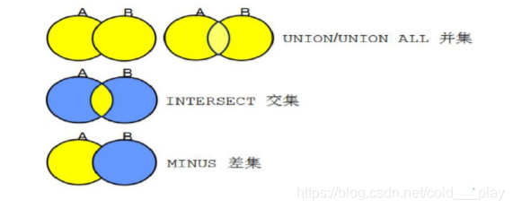

title: 集合运算
top_img: 
categories: 
- ETL工程师
- SQL基础
tags:
- 集合运算

# 集合运算




## 并集（UNION/UNION ALL）

UNION 并集去重

UNION ALL 并集不去重

Union可以对两个或多个结果集进行连接，形成“并集”。**子结果集所有的记录组合在一起形成新的结果集。**


**限定条件：**

要是用Union来连接结果集，有4个**限定条件**。

> 1. 子结果集要具有相同的结构。
> 2. 子结果集的列数必须相同。
> 3. 子结果集对应的数据类型必须可以兼容。
> 4. 每个子结果集不能包含order by子句。

**语法格式：**

```sql
select_statement union [all] select_statement
```

> all代表最终的结果集中将包含所有的行，而**不能删除重复行**。

**例子：**

```sql
select * from emp union select * from emp; --去重

SELECT Name FROM Person_1
UNION
SELECT Name FROM Person_2；
```


语法：
SELECT 语句
UNION
SELECT 语句
UNION ALL
SELECT 语句
...

```sql
SELECT * FROM EMP
UNION
SELECT * FROM EMP;

SELECT * FROM EMP
UNION
SELECT * FROM DEPT;
```

### 1.前后列数得保持一致

### 2.一列内数据类型得保持一致

```sql
SELECT ENAME FROM EMP
UNION
SELECT DNAME FROM DEPT;
```

### 3.结果按照第一列升序排序

```sql
SELECT DEPTNO FROM EMP--10,20,30
UNION
SELECT DEPTNO FROM DEPT;--10,20,30,40

SELECT ENAME,DEPTNO FROM EMP
UNION
SELECT DNAME,DEPTNO FROM DEPT;

SELECT ENAME ,DEPTNO A FROM EMP
UNION
SELECT DNAME 部门名称,DEPTNO B FROM DEPT;
```


### 4.最后结果的列名是按照第一个SELECT语句中的名称确定的


```sql
SELECT ENAME ,DEPTNO A FROM EMP
UNION
SELECT DNAME 部门名称,LOC B FROM DEPT;--报错，上下数据类型不一致

WHERE：
查询姓名为SMITH或者SCOTT的所有员工信息
select * from emp where ename='SMITH'
union
select * from emp where ename='SCOTT'; 

select * from emp  where ename ='SMITH' union select * from emp where ename='SCOTT';--可以

GROUP BY ：
select DEPTNO from emp GROUP BY DEPTNO
union
select DEPTNO from emp GROUP BY SAL,DEPTNO; 

select DEPTNO from emp 
union
select DEPTNO from emp GROUP BY SAL,DEPTNO; --去重

ORDER BY ：
select DEPTNO from emp ORDER BY DEPTNO
union
select DEPTNO from emp ORDER BY DEPTNO; --报错

select DEPTNO from emp
union
select DEPTNO from emp ORDER BY DEPTNO DESC;

select DEPTNO from emp ORDER BY DEPTNO
union
select DEPTNO from emp ;--报错
```

### 5.ORDER BY 只能放在最后一个语句里面

```sql
SELECT SNAME FROM STUDENT
UNION
SELECT SNAME FROM STUDENTS ORDER BY SNAME DESC;--没有按照中文字的拼音排序

select DEPTNO  from emp 
union
select EMPNO from emp   order by DEPTNO DESC; --报错
--在集合运算中，排序最好把前面的语句转变成FROM子查询

SELECT * FROM EMP A JOIN DEPT B ON A.DEPTNO = B.DEPTNO C--表连接后无法直接加别名

select  max(sal) A  from emp group by deptno
union
select  min(sal)  from emp where deptno =20 group by deptno  order by A desc ;--报错，在第一个SELECT语句中起别名即可


SELECT DEPTNO FROM EMP GROUP BY DEPTNO ORDER BY MIN(SAL);
SELECT * FROM EMP GROUP BY  ORDER BY MAX(SAL);
```

> **总结:**
>
> 1. 结果会去重
> 2. 列数得保持一致，同一列内数据类型得保持一致
> 3. 列名以第一个SELECT语句为准
> 4. 结果默认以第一列升序排列
> 5. ORDER BY 只能写在最后一个SELECT 语句中
>

### UNION ALL 并集不去重

```sql
SELECT * FROM EMP
UNION ALL
SELECT * FROM EMP;

SELECT DEPTNO FROM EMP
UNION ALL
SELECT DEPTNO FROM EMP;
--UNION ALL 没有按照第一列升序排列

SELECT DEPTNO FROM EMP
UNION ALL
SELECT DEPTNO,EMPNO FROM EMP;--报错，列数不一致

SELECT DEPTNO FROM EMP
UNION ALL
SELECT ENAME FROM EMP;--报错，数据类型不一致

SELECT DEPTNO  FROM EMP
UNION ALL
SELECT DEPTNO B FROM EMP;
--列名还是以第一个SELECT语句为准

SELECT DEPTNO FROM EMP ORDER BY DEPTNO
UNION ALL
SELECT DEPTNO FROM EMP ORDER BY DEPTNO;
--ORDER BY 只能放在最后一个SELECT 语句中

SELECT 2 FROM EMP
UNION
SELECT 1 FROM EMP
UNION  ALL
SELECT 3 FROM EMP;-- 1  ，   2  ，  14个3

SELECT 1,2 FROM EMP
UNION
SELECT 2,3 FROM EMP
UNION  
SELECT 2,3 FROM EMP;--1   2  , 2    3

SELECT 1,2 FROM EMP
UNION
(SELECT 2,3 FROM EMP
UNION  ALL
SELECT 2,3 FROM EMP);--1  2  ， 2   3
--有括号的先运行括号
```


## 交集（INTERSECT）


```sql
select ename,sal from emp where sal between 700 and 1300 
intersect
select ename,sal from emp where sal between 1201 and 1400; 
```

```sql
SELECT DEPTNO FROM EMP
INTERSECT
SELECT DEPTNO FROM DEPT;
--会去重

SELECT SAL FROM EMP
INTERSECT
SELECT SAL FROM EMP;
--结果会默认以第一列升序排列

SELECT 2 FROM EMP
INTERSECT
SELECT 1 FROM EMP
INTERSECT
SELECT 3 FROM EMP;-- 找不到任何东西

SELECT 1,2 FROM EMP
INTERSECT
SELECT 2,3 FROM EMP
INTERSECT
SELECT 2,3 FROM EMP;-- 找不到任何东西

SELECT 1,2 FROM EMP
INTERSECT
(SELECT 2,3 FROM EMP
INTERSECT
SELECT 2,3 FROM EMP);-- 找不到任何东西
```

> ==总结==：
> 作用是输出重复的部分，必须得所有的东西都一致才能输出

## 差集（MINUS）

　minus可以对两个或多个结果集进行连接，形成“差集”。**返回左边结果集合中已经有的记录，而右边结果集中没有的记录。**

==作用==：输出第一个查询语句中独有的内容

　　　限定条件：

　　　　1、子结果集要具有相同的结构。

　　　　2、子结果集的列数必须相同。

　　　　3、子结果集对应的数据类型必须可以兼容。

　　　　4、每个子结果集不能包含order by 子句。

　　　　语法形式：

```sql
select_statement minus select_statement　
```

　　　　自动删除重复行。

　　　　示例：

```sql
　　SELECT Name FROM Person_1
　　minus
　　SELECT Name FROM Person_2
```


> **注意：**
>
> 　　1.ORDER BY是对整个运算后的结果排序，并不是对单个数据集。
>
> 　　2.ORDER BY后面排序的字段名称是第一个数据集的字段名或者别名。


```sql
SELECT DEPTNO FROM EMP--10 20 30
MINUS
SELECT DEPTNO FROM DEPT;-- 10 20 30 40 --找不到任何东西

SELECT DEPTNO FROM DEPT--10 20 30 40
MINUS
SELECT DEPTNO FROM EMP;--10 20 30--输出40

SELECT * FROM EMP
MINUS
SELECT * FROM EMP ;--找不到任何东西

SELECT EMPNO FROM EMP
MINUS
SELECT ENAME FROM EMP WHERE DEPTNO = 20 AND ENAME = 'SMITH';--输出10和30号部门的人

```


## 补充

当union all和order by 如下一起使用时，会报sql未正确结束

```sql
select name,age from student order by age

union all

select name,age from person order by age
```

通用的解决方法有三种：

1、将结果集==作为一张临时表==然后查询排序

```sql
select * from (select name,age from student 

union all

select name,age from person order by age) order by age
```

2、单独`对表进行排序后`进行并集操作

```sql
select * from (select name,age from student order by age)

union all

select * from (select name,age from person order by age)
```

3、order by + 字段在结果集中的序号

```sql
select name,age from student 

union all

select name,age from person 

order by 2
```


### [将多个列合并成为一个新的维度](https://blog.csdn.net/weixin_43363860/article/details/114940917)

单查多列+并集运算

### PIVOT

**将维度数据==拆解==成多个列**
—对应 SUM (CASE WHEN …)

```sql
SELECT *
   FROM TB PIVOT(SUM(TB.COL1)
      FOR TB.COL2
          IN (VAL1 AS NEW_COL1,
              VAL2 AS NWE_COL2,
              VAL3 AS NEW_COL3)
             );
```

> TIPS:
>
> - PIVOT函数一定要有聚合函数 TB.COL1:被聚合分析的字段 TB.COL2：被拆解的字段
>
> - VAL1,VAL2,VAL3:TB.COL2字段中的某值 NEW_COL1,NEW_COL2,NEW_COL3: 字段拆解后形成的新字段
> - AS NEW_COL: 这个部分可不写，不写就以VAL作为字段名展示

### UNPIVOT

将多个列==合并==成一个维度
—对应UNION ALL

```sql
SELECT *
   FROM TB UNPIVOT (NEW_COL1 FOR NEW_COL2
          IN (
                TB.COL1 AS VAL1,
                TB.COL2 AS VAL2,
                TB.COL3 AS VAL3)
          );
```

>
> TIPS:
>
> - UNPIVOT函数不需要聚合函数 NEW_COL1：用来收纳交叉数据的字段，字段名自取 NEW_COL2：新和成的维度字段，名字自取
> - TB.COL1,TB.COL2,TB.COL3: 被并入的字段 VAL1,VAL2,VAL3: 并入的字段以怎样的数据内容录入新维度字段
> - AS VAL :这个部分可不写 ，不写则以TB.COL的名字作为字段名


==大总结==：

- 所有的集合运算可以反复交叉使用
  UNION、INTERSECT、MINUS都会去重，UNION ALL不去重
  UNION、INTERSECT、MINUS都会默认以第一列升序排列，UNION ALL不会
  有括号的先运行括号里的内容
  列名以第一个SELECT语句为准
  ORDER BY 只能放在最后一个语句里面
  列数必须保持一致，一列内数据类型必须保持一致

