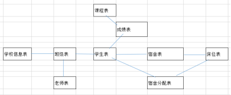
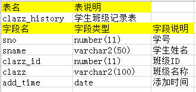

# 练习题


## 触发器练习题



1、写一个存储过程，添加一条学生信息，只允许有一个参数，需要判断添加的班级否存在，不存在抛出异常。

```plsql

```


2、写一存储过程，分配宿舍，传入一个学生ID和床位编号，返回“学生名入住宿舍名”，并变更宿舍信息（包括床位的状态等）

```plsql

```


3、写一个存储过程，根据学生编号将一个学生的所有信息从数据库中删除，学生信息包含班级，成绩，宿舍等信息

```plsql

```


4、有一个学生班级记录表，字段如下：



当前学生报到或者转变班级时，向clazz_history表中添加一条记录(触发器实现) 

```plsql

```


